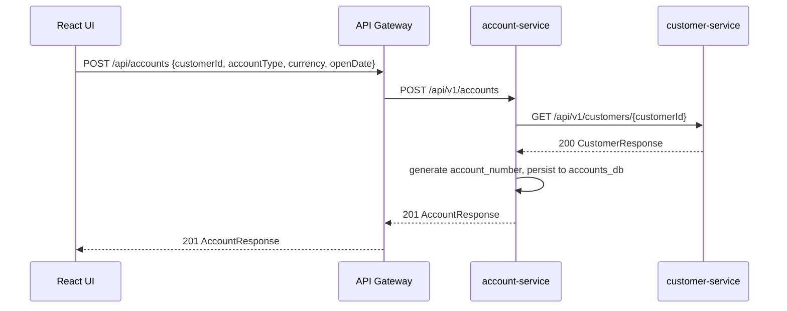
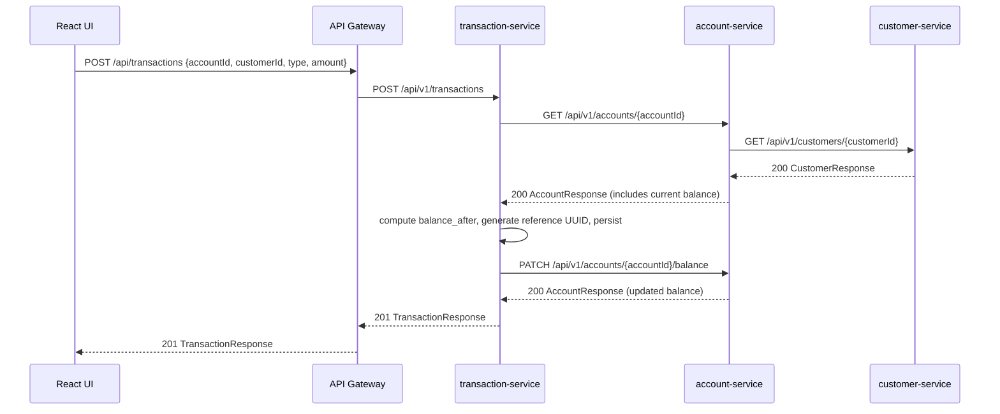

# Banking App — Concept

## What This Is

A minimal banking backend built as a learning platform for Spring Cloud microservices, distributed tracing, and GitOps. Three REST services together model a simple bank: customers open accounts, accounts receive transactions. The same data is consumed nightly by the batch-rating job to compute customer reliability scores.

This is not a production banking system. The goal is a realistic enough domain to practice:
- DB-per-service isolation and cross-service validation via OpenFeign
- OpenAPI-first contract design (YAML → generated interfaces → hand-written controllers)
- Micrometer + OpenTelemetry observability spanning all three services
- GitOps deployment via Argo CD + Helm

---

## Service Map

```
┌─────────────────────────────────────────────────────────────────┐
│  React Frontend  (Phase 2 — via API Gateway)                    │
└───────────────────────────┬─────────────────────────────────────┘
                            │ HTTP (JSON)
                            ▼
               ┌─────────────────────┐
               │   api-gateway :8080  │  Phase 2
               └──────────┬──────────┘
          ┌───────────────┼───────────────┐
          ▼               ▼               ▼
  ┌──────────────┐ ┌──────────────┐ ┌──────────────────┐
  │  customer-   │ │  account-    │ │  transaction-    │
  │  service     │ │  service     │ │  service         │
  │  :8081       │ │  :8082       │ │  :8083           │
  │  customers_db│ │  accounts_db │ │  transactions_db │
  └──────────────┘ └──────┬───────┘ └────────┬─────────┘
          ▲               │ OpenFeign          │ OpenFeign
          └───────────────┘                   │
          ▲                                   │
          └───────────────────────────────────┘

                            ┌────────────────────────────┐
                            │  batch-worker (nightly)    │
                            │  GET /average-balance/{id} │──→ account-service
                            │  GET /external-score/{id}  │──→ transaction-service
                            │  reads customers_db (MySQL)│──→ customer-service DB (read-only)
                            └────────────────────────────┘
```

**Call direction:** `transaction-service → account-service → customer-service`

- `customer-service` is standalone: no upstream dependencies
- `account-service` calls `customer-service` to validate a customer exists before opening an account
- `transaction-service` calls `account-service` to validate an account, then patches its balance after recording a transaction

Service discovery uses Kubernetes DNS — no Eureka/Consul needed:
```
http://customer-service.services.svc.cluster.local:8081
```

---

## Domain Model

```
Customer  1 ──────────── * Account  1 ──────────── * Transaction
  id                        id                        id
  first_name                account_number            reference_number
  last_name                 account_type              transaction_type
  email                     status                    amount
  status                    balance                   balance_after
                            currency                  transaction_date
```

A **Customer** is a person registered with the bank.
An **Account** is a financial product (checking, savings, credit, deposit) belonging to one customer.
A **Transaction** is an immutable financial event on an account (credit, debit, transfer, fee).

---

## Key Design Decisions

### No physical foreign keys across services

`accounts.customer_id` and `transactions.account_id` are logical references only — no database-level FK constraints. Each service validates the referenced entity by calling the owning service via OpenFeign at write time.

### Transactions are immutable

There are no `PUT`/`PATCH`/`DELETE` endpoints on transactions. A reversal creates a new transaction of the opposite type. This preserves the audit trail and simplifies the batch score calculation.

### `customer_id` denormalized in transactions

`transactions.customer_id` duplicates data that could be derived via `account_id → customer_id`. The duplication is intentional: the batch-worker queries transaction history by `customerId` across all accounts. Doing this without `customer_id` in the transactions table would require a cross-service join, breaking the isolation boundary.

### `balance_after` snapshot in transactions

Each transaction record stores the account balance at the time of the transaction. This avoids replaying the full transaction history to compute a point-in-time balance — important for the batch score calculation covering a 12-month window.

---

## React Frontend Vision

The frontend is out of scope for the current phase. When built, it will be a React SPA communicating exclusively with the API Gateway (Phase 2).

### Pages and navigation

```
/customers               CustomerListPage     — paginated table, filter by status/name
/customers/new           CustomerCreatePage   — form
/customers/:id           CustomerDetailPage   — tabs: Profile | Accounts | Transactions
/customers/:id/edit      CustomerEditPage     — form
/accounts                AccountListPage      — ?customerId filter
/accounts/new            AccountCreatePage    — customer typeahead
/accounts/:id            AccountDetailPage    — metadata + transaction list
/transactions/new        TransactionCreatePage — account typeahead
/transactions/:id        TransactionDetailPage
```

### Key data flows

**Opening an account:**



**Creating a transaction:**



### Auth (Phase 3)

Keycloak handles authentication at the Gateway level via OAuth2 Authorization Code + PKCE. Business services trust the Gateway and do not validate tokens themselves. Adding Keycloak does not require changes to the three business services.

---

## How the Batch System Connects

The batch-worker runs nightly and reads data from the microservices' databases directly (read-only, read-replica in production). It also calls two HTTP endpoints:

| Endpoint | Service | Purpose |
|---|---|---|
| `GET /api/v1/average-balance/{customerId}` | account-service | Average balance across all active accounts |
| `GET /api/v1/external-score/{customerId}` | transaction-service | Derived credit score from 12-month transaction behaviour |

The batch never writes to any microservice database. It writes its results (`customer_ratings`, `rating_processing_dlq`, `rating_processing_progress`) exclusively to its own PostgreSQL instance (`ratings_db`).

---

## API Contract Ownership

Each service owns its OpenAPI YAML spec:

```
docs/openapi/
  customer-service.yaml    ← owned by customer-service team
  account-service.yaml     ← owned by account-service team
  transaction-service.yaml ← owned by transaction-service team
```

When an API contract changes:
1. Update the YAML spec
2. Run `mvn generate-sources` — the Spring controller interface regenerates
3. Update the implementing `@RestController` (compiler enforces this)
4. Update the OpenFeign client in the calling service in the same commit (monorepo advantage)

See [openapi-first.md](openapi-first.md) for the full workflow and Maven plugin configuration.
